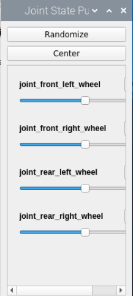
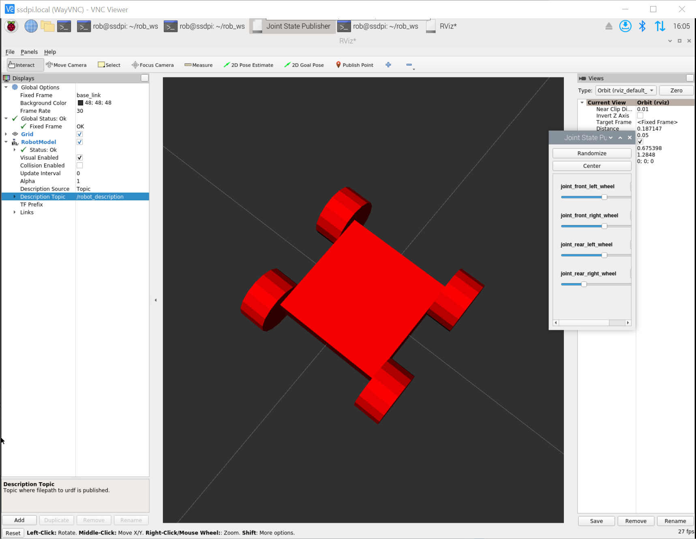

# Universal Robot Definition File
In this demo we are going to take a look at the urdf file that has been creatd to define a robot with four mecanum wheels. 
## Start the urdf publisher
1.  First we need to enable X-Windows for Docker so that we can run graphical applications if we need to. Note that you do this once per session. 
    ```
    xhost +local:
    ```
1.  Connect to the Docker image by moving into the sample folder, getting rid of any existing containers and then running the ROS image.
    ```
    cd ROS-Intro
    docker container prune
    source scripts/run_image.bash
    ```
1.  Once are in the docker image you need to move into the robot workspace.
    ```
    cd rob_ws

    ```
1.  Now do a build to update everything:
    ```
    colcon build --symlink-install
    ```
1.  Next setup the environment for running ROS commands:
    ```
    source install/setup.bash
    ```
1.  Start the robot service. This will publish the robot description for anyone to subscribe to. 
    ```
    ros2 launch rob_ws display_urdf_launch.py
    ```
    This command parses the urdf file and then publishes the information for other programs. If your urdf file is not valid it will fail with an error description which should take you to the broken statement in the urdf. If you change your robot design you will have to stop this command (use CTRL+C) and then rerun the command to publish an updated robot description.
## Start the joint publisher
In a real life environment the joint states would be published by the drive system based on the input from encoders on the drive system. This joint state publisher is provided with ROS and provides gui interface you can use to adjst the position of the joints in the robot. This is a good way of testing that your wheels rotate about the correct axes.

1.  Start a new command prompt.

1.  Change into the examples folder:
    ```
    cd ROS-Intro
    ```

1.  Now we want to execute a terminal connected to the existing docker image. 
    ```
    source scripts/exec_container.bash 
    ```
    This will start a command prompt connected to the docker container running the urdf ppublisher

1.  Once are in the docker image you need to move into the robot workspace.
    ```
    cd rob_ws
    ```
1.  Next setup the environment for running ROS commands:
    ```
    source install/setup.bash
    ```
1.  Now publish the joint movement information. 
    ```
    ros2 run joint_state_publisher_gui joint_state_publisher_gui
    ```


If you are wondering how the publisher "knows" what to put in the gui, it subscribes to the robot discription topic and uses this information to build the user interface. Now we can visualize the robot design.
## Visualize the robot with Rviz
You will need another command interface to do this. Open one and perform steps 1-5 above again. Now we can start Rviz.
1.  Use the command rviz2 to start rviz running:
    ```
    rviz2
    ```
    You will see some errors, but we are going to fix those. 
1.  First cick on the words "Fixed Frame" (it's right underneath "Global Options" in the left hand menu) and enter **base_link** as the fixed frame into the data field next to it. 
1.  Now click the Add button right at the bottom of this panel. This lets you add new display elements. We want to add a RobotModel so scroll down the displays to find this. Click on OK to add the model.
1.  The model is now being displayed, but it is not connected to a data source. We need to tell rviz2 where the robot data is coming from. Click the triangle next to the RobotModel item in the Displays dialog to open up all the settings. Now find the Description Topic item and click the topic value. Pick **/robot_description** from the list of topics. 

1.  The robot will now appear in the middle of the screen. Click in the display window and use the scroll wheel on your mouse to zoom in. If you move the sliders in the Joint State Publisher you will see the wheels turn. 


